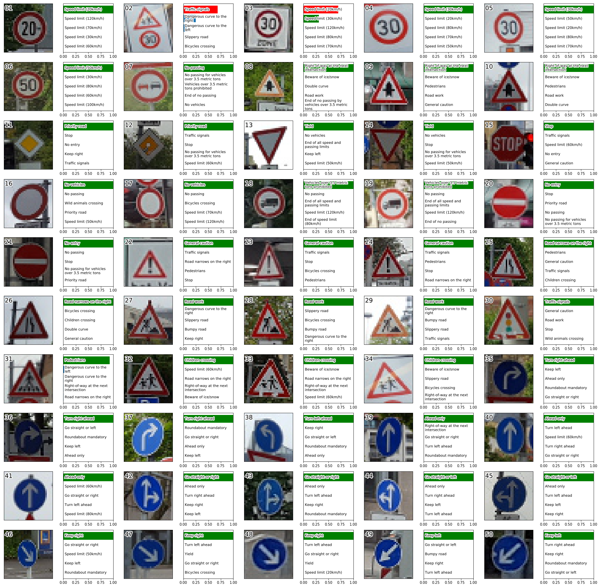

# **Traffic Sign Recognition**

Project to classify traffic signs in images using a convolutional neural network.

Full description of problem and task: [TASK.md](TASK.md)  
Source code: [Traffic_Sign_Classifier.ipynb](Traffic_Sign_Classifier.ipynb)  
IPython Notebook in HTML format: [report.html](report.html)  
Writeup: [WRITEUP.md](WRITEUP.md)  
Data Set: [German Traffic Signs](http://benchmark.ini.rub.de/?section=gtsrb&subsection=dataset)[1]  
Gathered Test Data: [traffic-signs-data/](traffic-signs-data/)

## Classifications of Gathered Test Data:

## References
1. J. Stallkamp, M. Schlipsing, J. Salmen, and C. Igel. The German Traffic Sign Recognition Benchmark: A multi-class classification competition. In Proceedings of the IEEE International Joint Conference on Neural Networks, pages 1453–1460. 2011. 
